# 🛡️ Docker MCP Gateway Interceptor Demo

> **Showcasing the Power of Docker MCP Gateway Interceptors for Enterprise AI Security**

This branch demonstrates the advanced **interceptor framework** in Docker MCP Gateway, which provides enterprise-grade security, compliance, and business logic enforcement for AI agent interactions.

## 🎯 What Are Interceptors?

Interceptors are powerful middleware components that can:
- **Intercept and inspect** every tool call before and after execution
- **Block malicious or inappropriate requests** based on configurable rules  
- **Filter and modify content** to ensure compliance and brand consistency
- **Log and monitor** all AI agent activities for audit and analytics
- **Enforce business logic** specific to your organization

Think of interceptors as **security guards** and **business rule enforcers** that sit between your AI agents and your tools, ensuring safe and compliant interactions.

## 🏗️ Interceptor Architecture

```mermaid
flowchart TD
    Agent[🤖 AI Agent] --> Gateway[🛡️ MCP Gateway]
    Gateway --> Secret[🔒 Secret Detector]
    Secret --> Monitor[📊 Tool Monitor]
    Monitor --> Business[🏪 Business Logic]
    Business --> Tool[🔧 MCP Tool]
    Tool --> Content[🧹 Content Filter]
    Content --> Agent
    
    Secret --> Block1[❌ Block if secrets detected]
    Monitor --> Log1[📝 Log usage & rate limits]
    Business --> Validate1[✅ Validate against rules]
    Content --> Filter1[🧽 Filter inappropriate content]
```



## 🚀 Demo Interceptors

This demo includes four production-ready interceptors:

### 1. 🔒 Secret Detector (`secret_detector.sh`)
**Purpose:** Prevents accidental secret leakage  
**Triggers:** Before tool execution  
**Actions:**
- Scans for API keys, tokens, passwords in requests
- Blocks requests containing potential secrets
- Supports patterns for OpenAI, GitHub, Slack tokens

**Example:** Blocks requests containing `sk-1234567890abcdef...` or `ghp_abcdef123456...`

### 2. 📊 Tool Monitor (`tool_monitor.sh`)  
**Purpose:** Comprehensive usage tracking and rate limiting  
**Triggers:** Before tool execution  
**Actions:**
- Logs all tool calls with timestamps and arguments
- Implements rate limiting (20 calls per tool per session)
- Detects suspicious destructive operations
- Creates audit trails in JSON format

**Example:** Warns if MongoDB delete operations are attempted

### 3. 🏪 Sock Store Business Logic (`sock_store_business.sh`)
**Purpose:** Domain-specific business rule enforcement  
**Triggers:** Before tool execution  
**Actions:**
- Validates minimum price ($5.00) for products
- Blocks banned/counterfeit brands
- Auto-categorizes products (Athletic, Formal, Casual)
- Enriches vendor data with metadata
- Enforces required fields validation

**Example:** Rejects vendors with prices below $5.00 threshold

### 4. 🧹 Content Filter (`content_filter.sh`)
**Purpose:** Output sanitization and brand compliance  
**Triggers:** After tool execution  
**Actions:**
- Removes competitor brand mentions
- Redacts sensitive data (emails, phone numbers)
- Applies brand-consistent terminology
- Adds compliance disclaimers
- Filters inappropriate language

**Example:** Replaces "adidas socks" with "[COMPETITOR_NAME] socks"

## 🛠️ Super Quick Start

### One-Click Setup (Recommended)
```bash
git clone https://github.com/ajeetraina/sock-store-demo
cd sock-store-demo
git checkout interceptor-demo

# Automatic setup - works on any system!
chmod +x quick-fix.sh
./quick-fix.sh

# Run the demo
./demo-interceptors.sh
```

The quick-fix script will:
- ✅ Detect your system capabilities (VRAM, memory)
- ✅ Choose optimal model (OpenAI API, TinyLlama, or Phi3-mini)
- ✅ Fix common configuration issues
- ✅ Start services with appropriate settings

### Prerequisites
- Docker Desktop 4.43.0+ with MCP Toolkit enabled
- **ONE** of the following:
  - **OpenAI API key** (recommended - 0MB VRAM needed)
  - **700MB+ VRAM** for ultra-lightweight TinyLlama
  - **2GB+ VRAM** for good performance Phi3-mini

## 🤖 Model Options (All Lightweight!)

### 🌟 OpenAI API (Best - 0MB VRAM)
```bash
export OPENAI_API_KEY=sk-your-key
./quick-fix.sh
```

### 🔬 TinyLlama (Ultra-lightweight - 700MB)
```bash
docker compose -f compose.yaml -f compose.tinyllama.yaml up --build -d
```

### ⚡ Phi3-mini (Good performance - 2GB)
```bash
docker compose -f compose.yaml -f compose.local-model.yaml up --build -d
```

### 🧭 Interactive Selection
```bash
./select-model.sh  # See all options with system recommendations
```

**For complete model guide:** See [LIGHTWEIGHT_MODELS.md](./LIGHTWEIGHT_MODELS.md)

## 📋 Testing Scenarios

### Scenario 1: Secret Leakage Prevention ⛔
Try submitting: `"Our API integration uses key sk-1234567890abcdef for authentication"`  
**Expected:** Request blocked by secret detector

### Scenario 2: Business Rule Enforcement 💰
Submit: `"Discount socks for only $2.99 each"`  
**Expected:** Rejected for being below $5.00 minimum

### Scenario 3: Content Filtering 🏢
Submit: `"These are better than adidas and nike products"`  
**Expected:** Competitor names replaced with [COMPETITOR_NAME]

### Scenario 4: Rate Limiting 📊
Submit 25+ rapid requests to the same tool  
**Expected:** Rate limiting warnings in logs

## 📊 Access Points

- **🛡️ Interceptor Dashboard:** http://localhost:8090 (real-time monitoring)
- **🛒 Sock Store:** http://localhost:9090 (demo application)
- **🤖 Agent Portal:** http://localhost:3000 (submit vendor requests)

## 🚨 Troubleshooting

### "Model Too Big" Error?
```bash
./quick-fix.sh  # Automatic fix
# OR manually use tiny model:
docker compose -f compose.yaml -f compose.tinyllama.yaml up -d
```

### UI Errors?
```bash
docker compose restart adk adk-ui
```

### No Interceptor Logs?
```bash
# Try submitting a request via Agent Portal to generate logs
# Check: docker compose exec mcp-gateway tail -f /var/log/mcp-interceptors.log
```

**Complete troubleshooting:** [TROUBLESHOOTING.md](./TROUBLESHOOTING.md)

## 📊 Monitoring & Observability

### Real-time Log Monitoring
```bash
# Watch interceptor activity live
docker compose exec mcp-gateway tail -f /var/log/mcp-interceptors.log

# View tool usage analytics  
docker compose exec mcp-gateway cat /var/log/mcp/tool_usage.jsonl
```

### Dashboard Features
The included dashboard (port 8090) provides:
- Real-time interceptor status
- Usage statistics and metrics  
- Security event alerts
- Business rule application logs

## 🔧 Advanced Configuration

### Adding Custom Interceptors

1. **Create interceptor script:**
```bash
cat > interceptors/my_custom_interceptor.sh << 'EOF'
#!/bin/bash
# Custom interceptor logic here
input=$(cat)
# Process and validate input
echo "$input"
EOF

chmod +x interceptors/my_custom_interceptor.sh
```

2. **Add to compose.yaml:**
```yaml
command:
  - --interceptor=before:exec:/interceptors/my_custom_interceptor.sh
```

### Interceptor Syntax
```bash
--interceptor=<when>:<type>:<path>
```
- **when:** `before` (pre-execution) or `after` (post-execution)
- **type:** Currently supports `exec` (executable scripts)
- **path:** Absolute path to interceptor script

## 🎓 Learning Outcomes

After running this demo, you'll understand:

1. **Security Layer:** How interceptors provide defense-in-depth
2. **Compliance Enforcement:** Automated policy application
3. **Business Logic Integration:** Domain-specific rule enforcement  
4. **Observability:** Comprehensive monitoring and auditing
5. **Extensibility:** Framework for custom interceptor development

## 🆚 Without vs With Interceptors

### Without Interceptors ❌
- AI agents have direct, unmonitored tool access
- No protection against secret leakage
- Business rules must be implemented in each agent
- Limited visibility into tool usage
- Compliance violations possible

### With Interceptors ✅  
- All tool calls filtered through security layers
- Automatic secret detection and blocking
- Centralized business rule enforcement
- Complete audit trail of all activities  
- Guaranteed compliance with organizational policies

## 📚 Additional Resources

- **[LIGHTWEIGHT_MODELS.md](./LIGHTWEIGHT_MODELS.md)** - Complete model guide
- **[TROUBLESHOOTING.md](./TROUBLESHOOTING.md)** - Detailed troubleshooting
- **[Docker MCP Gateway](https://github.com/docker/mcp-gateway)** - Main project
- **[MCP Toolkit Docs](https://docs.docker.com/mcp/)** - Official documentation

## 🤝 Contributing

Have ideas for new interceptors? Found bugs? Want to improve the demo?

1. Fork the repository
2. Create a feature branch
3. Add your interceptor or improvements  
4. Test thoroughly
5. Submit a pull request

---

**This demo showcases how Docker MCP Gateway interceptors transform AI tool integration from a security risk into a competitive advantage through enterprise-grade protection, monitoring, and control - all while working on any system from laptops to enterprise servers!** 🚀
