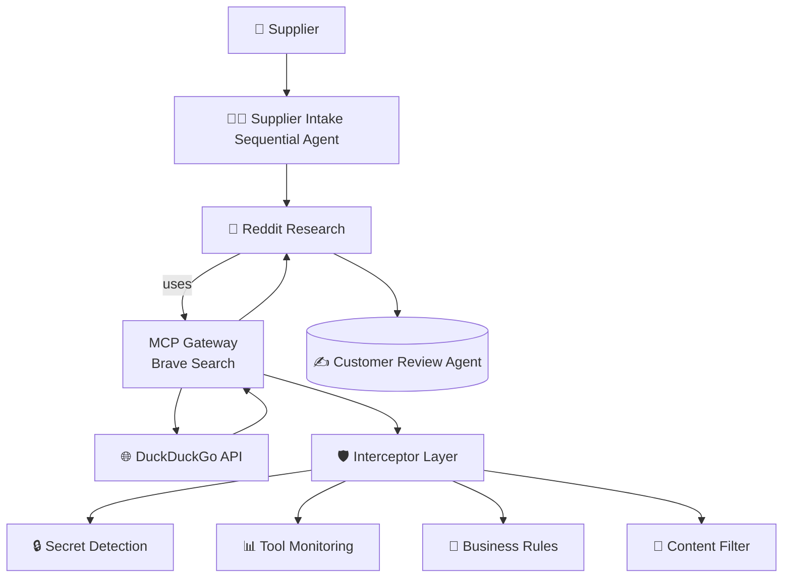

# 🧠 ADK Multi-Agent Fact Checker

> [!Tip]
> ✨ No configuration needed — run it with a single command.

> [!Important]
> 🛡️ **NEW: Docker MCP Gateway Interceptor Demo** - Check out the `interceptor-demo` branch to see enterprise-grade security, compliance, and business logic enforcement in action! See [INTERCEPTOR_DEMO.md](./INTERCEPTOR_DEMO.md) for details.

# 🚀 Getting Started

### Requirements

+ **[Docker Desktop] 4.43.0+ or [Docker Engine]** installed.
+ **OpenAI API key** (recommended) OR **A laptop or workstation with a GPU** (e.g., a MacBook) for running open models locally. If you
  don't have a GPU, you can alternatively use **[Docker Offload]**.
+ If you're using [Docker Engine] on Linux or [Docker Desktop] on Windows, ensure that the
  [Docker Model Runner requirements] are met (specifically that GPU
  support is enabled) and the necessary drivers are installed.
+ If you're using Docker Engine on Linux, ensure you have [Docker Compose] 2.38.1 or later installed.

### Run the project

Some of the MCP servers used here require Secrets. Set the Brave and Reset api keys and then set the secrets for the gateway.

```sh
export BRAVE_API_KEY=<your_brave_api_key>
export RESEND_API_KEY=<resend_api_key>
export OPENAI_API_KEY=<openai_api_key>
make gateway-secrets
```

If you're running with an arm64 macos machine, then initialize the environment with one additional command:

```sh
DOCKER_DEFAULT_PLATFORM=linux/amd64 docker pull roberthouse224/catalogue
```

To start up the Sock Store and the Agent portal, run:

```sh
docker compose up --build
```

+ Open [*http://localhost:9090*](http://localhost:9090) to see the sock store.
+ Open [*http://localhost:3000*](http://localhost:3000) to see the Sock Vendor Agent Portal.

# 🛡️ Interceptor Demo

For a comprehensive demonstration of Docker MCP Gateway's interceptor framework providing enterprise-grade security and compliance:

```sh
git checkout interceptor-demo
```

## Quick Start (Recommended)

If you experience any "model too big" errors or startup issues:

```sh
# Run the automatic fix script
chmod +x quick-fix.sh
./quick-fix.sh
```

This script will:
- ✅ Detect your system capabilities
- ✅ Choose optimal configuration (OpenAI API vs local model)
- ✅ Fix common permission and configuration issues
- ✅ Start services with appropriate settings

## Manual Setup

```sh
# Set up environment
export BRAVE_API_KEY=<your_key>
export RESEND_API_KEY=<your_key>
export OPENAI_API_KEY=<your_key>
make gateway-secrets

# Option A: Use OpenAI API (recommended - no VRAM needed)
docker compose up --build -d

# Option B: Use smaller local model (requires ~2GB VRAM)
docker compose -f compose.yaml -f compose.local-model.yaml up --build -d

# Run the interceptor demo
./demo-interceptors.sh
```

## What You'll See

The interceptor demo showcases:
- **🔒 Secret Detection:** Prevents API key leakage
- **📊 Tool Monitoring:** Usage tracking and rate limiting  
- **🏪 Business Logic:** Domain-specific rule enforcement
- **🧹 Content Filtering:** Output sanitization and brand compliance

## Access Points

- **🛡️ Interceptor Dashboard:** http://localhost:8090
- **🛒 Sock Store:** http://localhost:9090
- **🤖 Agent Portal:** http://localhost:3000

## Troubleshooting

- **Model too big error?** Run `./quick-fix.sh` or use OpenAI API
- **UI errors?** Restart with `docker compose restart adk adk-ui`
- **Missing logs?** Try submitting a request via the Agent Portal
- **Need help?** See [TROUBLESHOOTING.md](./TROUBLESHOOTING.md)

For complete documentation: [INTERCEPTOR_DEMO.md](./INTERCEPTOR_DEMO.md)

# ❓ What Can It Do?

Example input to the portal:

> "I am a sock vendor named Nike. Perhaps you've heard of us. We provide colorful compressions socks,
> that are elegant and affordable.  Our Nike compression socks are 12.99 each.  
> Here are some urls to images of the socks <https://tinyurl.com/5n6spnvu> and
> <https://tinyurl.com/mv8ebjnh>"

With interceptors enabled, this submission will:
1. 🔍 Be scanned for secrets/credentials (none found - ✅ allowed)
2. 📊 Get logged for usage monitoring and compliance
3. 🏪 Pass business rule validation (price above $5.00 minimum - ✅ valid)
4. 🧹 Have any competitor mentions filtered in the response

# 🔧 Architecture Overview



# 🤝 Agent Roles

| **Agent**   | **Tools Used**        | **Role Description**                                                         |
| ----------- | --------------------- | ---------------------------------------------------------------------------- |
| **Supplier Intake**  |  None                | Resesarches a new sock vendor and decides whether to onboard them to the store |
| **Reddit Research**  |  BraveSearch via MCP | Searches for reviews on the vendor                             |
| **Customer Review**  |  MongoDB via MCP     | Match styles against historical buyer data to see if it's a match for the store |
| **Catalog**          |  curl via MCP        | Adds the product sku to the catalog if we like the product |

**All agent interactions are now secured and monitored by Docker MCP Gateway interceptors!**

# 🧹 Cleanup

To stop and remove containers and volumes:

```sh
docker compose down -v
```

# 📎 Credits

+ [ADK]
+ [Docker Compose]
+ [Docker MCP Gateway](https://github.com/docker/mcp-gateway)

[ADK]: https://google.github.io/adk-docs/
[Docker Compose]: https://github.com/docker/compose
[Docker Desktop]: https://www.docker.com/products/docker-desktop/
[Docker Engine]: https://docs.docker.com/engine/
[Docker Model Runner requirements]: https://docs.docker.com/ai/model-runner/
[Docker Offload]: https://www.docker.com/products/docker-offload/
