# 🧠 ADK Multi-Agent Fact Checker

> [!Tip]
> ✨ No configuration needed — run it with a single command.

> [!Important]
> 🛡️ **NEW: Docker MCP Gateway Interceptor Demo** - Check out the `interceptor-demo` branch to see enterprise-grade security, compliance, and business logic enforcement in action! See [INTERCEPTOR_DEMO.md](./INTERCEPTOR_DEMO.md) for details.

# 🚀 Getting Started

### Requirements

+ **[Docker Desktop] 4.43.0+ or [Docker Engine]** installed.
+ **ONE** of the following:
  - **OpenAI API key** (recommended - no local resources needed)
  - **700MB+ VRAM** for ultra-lightweight models
  - **2GB+ VRAM** for good performance local models

### Super Quick Start (Recommended)

```sh
git checkout interceptor-demo

# Automatic setup - detects your system and chooses best model
chmod +x quick-fix.sh
./quick-fix.sh

# Run the interceptor demo
./demo-interceptors.sh
```

**That's it!** The quick-fix script will automatically:
- ✅ Detect your system capabilities (VRAM, memory)
- ✅ Choose the optimal model configuration
- ✅ Fix common issues automatically
- ✅ Start the services with appropriate settings

## 🤖 Model Options (All Lightweight!)

Don't have powerful hardware? No problem! We support ultra-lightweight models:

### 1. 🌟 OpenAI API (Recommended)
```sh
export OPENAI_API_KEY=sk-your-key
./quick-fix.sh
```
- **VRAM needed:** 0MB
- **Cost:** ~$0.50-2.00 per session
- **Performance:** Excellent

### 2. 🔬 TinyLlama (Ultra-lightweight)
```sh
docker compose -f compose.yaml -f compose.tinyllama.yaml up --build -d
```
- **VRAM needed:** 700MB (works on most laptops!)
- **Download:** 700MB
- **Performance:** Basic but functional

### 3. ⚡ Phi3-mini (Good performance)
```sh
docker compose -f compose.yaml -f compose.local-model.yaml up --build -d
```
- **VRAM needed:** 2GB
- **Download:** 2.3GB
- **Performance:** Good

### 4. 🧭 Let the system choose for you
```sh
./select-model.sh  # Interactive model selection
```

## Manual Setup (If you prefer to do it yourself)

```sh
# Set up secrets
export BRAVE_API_KEY=<your_brave_api_key>
export RESEND_API_KEY=<resend_api_key>
export OPENAI_API_KEY=<openai_api_key>  # Optional but recommended
make gateway-secrets

# Choose ONE of these startup options:

# Option A: OpenAI API (0MB VRAM needed)
echo "sk-your-openai-key" > secret.openai-api-key
docker compose up --build -d

# Option B: Ultra-lightweight TinyLlama (700MB VRAM)
docker compose -f compose.yaml -f compose.tinyllama.yaml up --build -d

# Option C: Good performance Phi3-mini (2GB VRAM)
docker compose -f compose.yaml -f compose.local-model.yaml up --build -d

# Option D: Custom model selection
# Edit compose.lightweight-models.yaml to uncomment your preferred model
docker compose -f compose.yaml -f compose.lightweight-models.yaml up --build -d
```

For ARM64 macOS users:
```sh
DOCKER_DEFAULT_PLATFORM=linux/amd64 docker pull roberthouse224/catalogue
```

## 🛡️ Interceptor Demo Features

The interceptor demo showcases:
- **🔒 Secret Detection:** Prevents API key leakage - try submitting "api_key=sk-123..."
- **📊 Tool Monitoring:** Usage tracking and rate limiting - make 25+ rapid requests
- **🏪 Business Logic:** Domain-specific rule enforcement - try price under $5.00
- **🧹 Content Filtering:** Output sanitization - mention "adidas" and see it filtered

## 🌐 Access Points

- **🛡️ Interceptor Dashboard:** http://localhost:8090 (real-time security monitoring)
- **🛒 Sock Store:** http://localhost:9090 (the demo store)
- **🤖 Agent Portal:** http://localhost:3000 (submit vendor requests here!)

## 🆘 Troubleshooting

### "Model Too Big" Error?
```sh
# Try the automatic fix first
./quick-fix.sh

# Or manually use the tiniest model
docker compose -f compose.yaml -f compose.tinyllama.yaml up --build -d
```

### UI Content Errors?
```sh
docker compose restart adk adk-ui
```

### Want to see all model options?
```sh
./select-model.sh
```

### Still having issues?
- See [TROUBLESHOOTING.md](./TROUBLESHOOTING.md) for detailed help
- Check service health: `docker compose ps`
- View logs: `docker compose logs adk`

## 📊 Model Comparison

| Model          | VRAM    | Download | Performance | Best For           |
|----------------|---------|----------|-------------|--------------------|
| **OpenAI API** | **0MB** | **0MB**  | **Excellent** | **Production use** |
| TinyLlama      | 700MB   | 700MB    | Basic       | Minimal systems    |
| Phi3-mini      | 2GB     | 2.3GB    | Good        | Most laptops       |
| Gemma 2B       | 1.5GB   | 1.6GB    | Fair        | Mid-range systems  |
| Llama 3.2 3B   | 2GB     | 2.0GB    | Good        | Balanced choice    |
| Mistral 7B     | 4GB     | 4.1GB    | Very Good   | High-end systems   |

# ❓ What Can It Do?

Example input to the portal:

> "I am a sock vendor named Nike. Perhaps you've heard of us. We provide colorful compressions socks,
> that are elegant and affordable.  Our Nike compression socks are 12.99 each.  
> Here are some urls to images of the socks <https://tinyurl.com/5n6spnvu> and
> <https://tinyurl.com/mv8ebjnh>"

With interceptors enabled, this submission will:
1. 🔍 Be scanned for secrets/credentials (none found - ✅ allowed)
2. 📊 Get logged for usage monitoring and compliance
3. 🏪 Pass business rule validation (price above $5.00 minimum - ✅ valid)
4. 🧹 Have any competitor mentions filtered in the response

Try these test scenarios:
- 🔒 **Secret detection:** "Our API key is sk-1234567890abcdef" (gets blocked!)
- 💰 **Business rules:** "Cheap socks for $2.99" (gets rejected!)
- 🏢 **Content filter:** "Better than adidas products" (gets filtered!)

# 🔧 Architecture Overview

```mermaid

flowchart TD
    input[📝 Supplier] --> supplier_intake[🧑‍⚖️ Supplier Intake Sequential Agent]
    supplier_intake --> reddit_research[🧠 Reddit Research]
    reddit_research -->|uses| mcp[MCP Gateway<br/>Brave Search]
    mcp --> brave[🌐 DuckDuckGo API]
    brave --> mcp --> reddit_research
    reddit_research --> customer_review[(✍️ Customer Review Agent)]
    
    mcp --> interceptors[🛡️ Interceptor Layer]
    interceptors --> secret[🔒 Secret Detection]
    interceptors --> monitor[📊 Tool Monitoring]
    interceptors --> business[🏪 Business Rules]
    interceptors --> filter[🧹 Content Filter]
```



# 🤝 Agent Roles

| **Agent**   | **Tools Used**        | **Role Description**                                                         |
| ----------- | --------------------- | ---------------------------------------------------------------------------- |
| **Supplier Intake**  |  None                | Researches a new sock vendor and decides whether to onboard them to the store |
| **Reddit Research**  |  BraveSearch via MCP | Searches for reviews on the vendor                             |
| **Customer Review**  |  MongoDB via MCP     | Match styles against historical buyer data to see if it's a match for the store |
| **Catalog**          |  curl via MCP        | Adds the product sku to the catalog if we like the product |

**All agent interactions are now secured and monitored by Docker MCP Gateway interceptors!**

# 🧹 Cleanup

To stop and remove containers and volumes:

```sh
docker compose down -v
```

# 📎 Credits

+ [ADK]
+ [Docker Compose]
+ [Docker MCP Gateway](https://github.com/docker/mcp-gateway)

[ADK]: https://google.github.io/adk-docs/
[Docker Compose]: https://github.com/docker/compose
[Docker Desktop]: https://www.docker.com/products/docker-desktop/
[Docker Engine]: https://docs.docker.com/engine/
[Docker Model Runner requirements]: https://docs.docker.com/ai/model-runner/
[Docker Offload]: https://www.docker.com/products/docker-offload/
